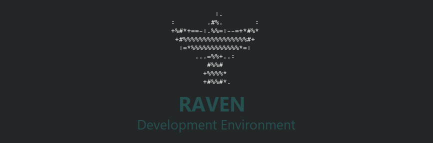

# Raven
Raven is a full stack development environment using Ansible. It contains playbooks to setup jdk, nodejs, docker, redis, postgressql, etc with other customization.

## Setup

> **Prerequisite** : Requires [Raven Box](https://github.com/yashendra-gupta/raven-box#raven-box) is up and running.

- Set up git ssh 
  ```shell
  ssh-keygen -t rsa -b 4096 -C <email-id>
  ```
- To see your ssh public key, open terminal and run:
  ```shell
  cat .ssh/id_rsa.pub
  ```
- Set RAVEN_UPDATE_BRANCH
  ```shell
  export RAVEN_UPDATE_BRANCH=master
  ```
- Run ansible playbook to setup the environment
 
  **Note:** In absence of `--checkout` option in `ansible-pull`, `ansible-pull` uses Git's default branch
  ```shell
  sudo -E ansible-pull --accept-host-key --private-key="/home/vagrant/.ssh/id_rsa"  --url="git@github.com:yashendra-gupta/raven.git" --checkout=$RAVEN_UPDATE_BRANCH local.yml
  ```
  

  **Note:** This will take one hour or so.

**Update Raven box**

Raven has capability to notify you about new updates availablility.

You can also use below commands :
- `raven-update-check` to check if there are any updates
- `raven-update` to update the Raven with latest configuration

## Developing Raven
- To develop raven clone this repository and start working on it.
- Test your changes, by running `sudo ansible-playbook ./local.yml` from project's root directory

## Shell Prompt
- If directory is Git project, then shell prompt also display Git's current branch followed by optional symbols :
  - `*` : indicates that there are changes but not staged for commit
  - `+` : indicates that there are changes but staged for commit
  - `%` : indicates that there are untracked files
  
  

## Command
- Use `code` command to launch Visual Studio code
- Use `ideac` command to launch IntelliJ IDEA communitiy edition
- Use `jmc` command to launch Java Mission Control

## Adding shared folders


# Troubleshoot

1. On fresh installation post anisble play, somtimes machine might not start. To resolve, just do clean installation again.
2. On fresh installation post ansible play, there may be a possibility that normal GNOME/Ubuntu login screen will be shown. This may look strange provided that the installed desktop was KDE plasma desktop. So, in order to use KDE, remember to choose plasma during login. To view this option, click on login's username texbox and a icon will be shown in bottom right corner.
3. On launchin chrome, cancel 

4. On fresh installation post ansible play, desktop screen may flicker. To resolve this, just close virtual box and reopen.
5. If raven-update fails with error message related to apt cache, then manually run `sudo apt update` to see which registery is throwing error and if the thrown error is 

    `An error occurred during the signature verification. The repository is not updated and the previous index files will be used. GPG error: http://repo.mysql.com/apt/ubuntu focal InRelease: The following signatures couldn't be verified because the public key is not available: NO_PUBKEY B7B3B788A8D3785C`

    `Failed to fetch http://repo.mysql.com/apt/ubuntu/dists/focal/InRelease  The following signatures couldn't be verified because the public key is not available:  NO_PUBKEY B7B3B788A8D3785C`

    then run below command -
    
    `sudo apt-key adv --keyserver keyserver.ubuntu.com --recv-keys B7B3B788A8D3785C`

    Note: replace the correct key in above command based on error message showing key.
6. **Maven dependecies download issue, when Raven is on jdk 8** : If maven dependecies failing with error `InvalidAlgorithmParameterException: the trustAnchors parameter must be non-empty` then install open-jdk 8 using `apt` by running `sudo apt-get install openjdk-8-jdk`